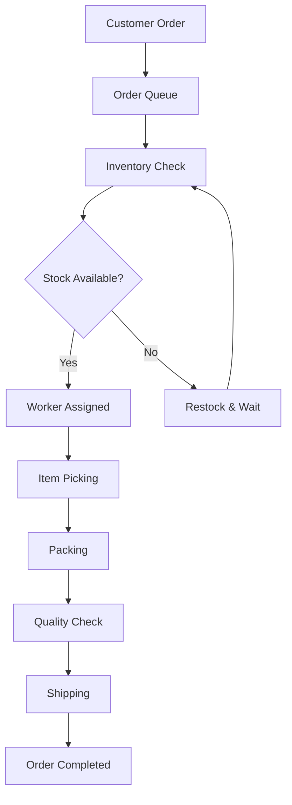
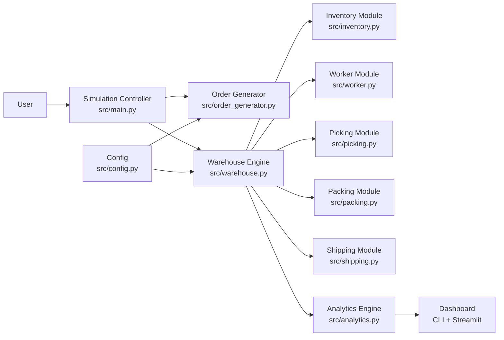

# Product Requirements Document (PRD)

# Warehouse Operations Simulation and Optimization Using SimPy

## Version

2.0

## Project Type

Supply Chain & Operations Management

---

# 1. Project Overview

## Project Title

**Warehouse Operations Simulation and Optimization Using SimPy**

## Problem Statement

Warehouses are a critical component of modern supply chains. Inefficient warehouse operations can lead to delayed deliveries, increased labor costs, congestion, and poor customer satisfaction. Organizations need a way to evaluate operational changes without disrupting real warehouse activities.

This project develops a discrete-event simulation of warehouse operations using Python and SimPy. The simulation models receiving, storage, order picking, packing, and shipping processes, enabling managers to identify bottlenecks and evaluate operational improvements.

---

# 2. Project Objective

Develop a warehouse simulation that:

* Models daily warehouse operations.
* Simulates inventory movement.
* Tracks worker and equipment utilization.
* Identifies operational bottlenecks.
* Evaluates different warehouse improvement strategies.
* Provides performance dashboards for decision-making.

---

# 3. Business Goals

The system should help warehouse managers:

* Reduce order fulfillment time.
* Increase warehouse throughput.
* Improve worker productivity.
* Reduce waiting times.
* Optimize resource allocation.
* Improve warehouse efficiency.

---

# 4. Stakeholders

* Warehouse Manager
* Operations Manager
* Supply Chain Analyst
* Logistics Team
* University Project Supervisor

---

# 5. Scope

## In Scope

* Warehouse simulation
* Inventory movement
* Worker allocation
* Order processing
* Picking simulation
* Packing simulation
* Shipping simulation
* Performance analytics
* Multiple simulation scenarios
* Interactive dashboard
* KPI visualization

## Out of Scope

* Real ERP integration
* Live warehouse sensors
* Barcode scanning
* Robotics control
* Financial accounting
* AGV/automation hardware control

---

# 6. Warehouse Workflow

---

# 7. Functional Requirements

## FR-1 Order Generation

The system shall generate customer orders at configurable intervals.

Inputs:

* Order ID
* Number of items
* Arrival time

Output:

* Order enters processing queue.

Implementation: `OrderGenerator` in `src/order_generator.py` — SimPy process generating orders with exponential inter-arrival times.

---

## FR-2 Inventory Storage

The warehouse shall maintain inventory levels.

Each product includes:

* Product ID
* Quantity
* Storage location (x, y coordinates)
* Reorder level

Implementation: `InventoryManager` in `src/inventory.py` — maintains product dict, supports allocation, restocking, and low-stock detection.

---

## FR-3 Worker Assignment

The system shall assign available workers to pending tasks.

Tasks include:

* Receiving
* Put-away
* Picking
* Packing
* Shipping

Implementation: `WorkerPool` in `src/worker.py` — wraps `simpy.Resource` with utilization sampling every simulated minute.

---

## FR-4 Picking Process

Workers travel to storage locations.

Simulation includes:

* Walking time (Euclidean travel distance / walking speed)
* Picking time (items × picking speed)
* Travel distance (packing station → product locations → packing station)

Implementation: `PickingProcess` in `src/picking.py` — calculates round-trip distance across all item locations.

---

## FR-5 Packing Process

Orders move to packing stations.

Packing includes:

* Waiting time (queue for station)
* Packing duration (gaussian distribution)
* Queue management

Implementation: `PackingProcess` in `src/packing.py` — `simpy.Resource` with configurable station count and gaussian packing times.

---

## FR-6 Shipping

Packed orders move to shipping dock.

Shipping includes:

* Loading
* Dispatch

Implementation: `ShippingProcess` in `src/shipping.py` — `simpy.Resource` with gaussian shipping times and order tracking.

---

## FR-7 Resource Utilization

Track utilization of:

* Workers
* Forklifts
* Packing stations

Implementation: Sampled at 1-minute intervals throughout simulation for accurate time-weighted averages.

---

## FR-8 Performance Dashboard

Display:

* Orders completed
* Orders pending
* Average waiting time
* Average processing time
* Worker utilization
* Throughput
* Packing queue length
* Shipping queue length

Implementation: `Analytics` class in `src/analytics.py` (matplotlib charts) and `dashboard.py` (Streamlit interactive dashboard).

---

# 8. Non-Functional Requirements

| Requirement | Target | Status |
|---|---|---|
| Performance | Simulate one warehouse day in under one minute | Achieved (~2-5 seconds) |
| Reliability | Reproducible using the same random seed | Achieved (configurable seed) |
| Scalability | Support up to 10,000 orders | Achieved |
| Usability | Dashboard with graphs and KPIs | Achieved (CLI + Streamlit) |
| Maintainability | Modular Python code | Achieved (7 modules) |

---

# 9. User Stories

### Warehouse Manager

"I want to know where delays occur so I can improve warehouse efficiency."

---

### Operations Manager

"I want to compare staffing levels before hiring additional workers."

---

### Supply Chain Analyst

"I want to test multiple warehouse layouts without affecting real operations."

---

# 10. System Architecture

---

# 11. Modules

## Module 1 — Order Generator (`src/order_generator.py`)

Generates customer orders with configurable inter-arrival times.

* Uses exponential distribution for realistic order arrival
* Assigns random items from product catalog
* Triggers order processing callbacks

---

## Module 2 — Inventory Management (`src/inventory.py`)

Maintains stock availability with location tracking.

* Product dictionary with stock levels
* Allocation and deallocation
* Restocking support
* Low-stock threshold alerts
* Euclidean coordinate locations for pick path calculation

---

## Module 3 — Worker Management (`src/worker.py`)

Manages worker pool as a SimPy resource.

* Configurable worker count
* Request/release via SimPy resource API
* 1-minute interval utilization sampling
* Available vs busy worker tracking

---

## Module 4 — Picking Module (`src/picking.py`)

Calculates travel distance and picking time.

* Euclidean distance between warehouse coordinates
* Round-trip path: packing station → all product locations → return
* Travel time = distance / walking speed
* Pick time = items × picking speed

---

## Module 5 — Packing Module (`src/packing.py`)

Manages packing station queue and processing.

* Configurable number of packing stations
* Gaussian-distributed packing duration
* Queue length sampling over time

---

## Module 6 — Shipping Module (`src/shipping.py`)

Dispatches completed orders.

* Configurable dock count
* Gaussian-distributed shipping duration
* Queue length sampling
* Completed order tracking

---

## Module 7 — Analytics Module (`src/analytics.py`)

Calculates KPIs and produces visualizations.

* Order completion time distribution
* Picking/packing duration histograms
* Worker utilization with target range overlays
* Throughput and order statistics
* Configurable chart output
* Scenario comparison summaries

---

# 12. Simulation Inputs

## Warehouse Parameters

| Parameter | Default | Description |
|---|---|---|
| `num_workers` | 5 | Number of picking workers |
| `num_forklifts` | 2 | Number of forklifts |
| `warehouse_capacity` | 10,000 | Total storage capacity |
| `num_packing_stations` | 3 | Packing stations available |
| `num_receiving_docks` | 2 | Receiving/shipping docks |

## Operational Parameters

| Parameter | Default | Description |
|---|---|---|
| `orders_per_hour` | 20 | Average order arrival rate |
| `picking_speed` | 0.5 min/item | Time to pick one item |
| `walking_speed` | 50 ft/min | Worker walking speed |
| `packing_time_mean` | 3.0 min | Mean packing duration |
| `packing_time_std` | 0.5 min | Packing duration std dev |
| `shipping_time_mean` | 2.0 min | Mean shipping duration |
| `shipping_time_std` | 0.3 min | Shipping duration std dev |
| `quality_check_time` | 1.0 min | Quality inspection time |
| `items_per_order_mean` | 3.0 | Mean items per order |
| `items_per_order_std` | 1.0 | Items per order std dev |

## Simulation Parameters

| Parameter | Default | Description |
|---|---|---|
| `working_hours` | 8.0 | Hours per shift |
| `shift_duration` | 8.0 | Shift length |
| `random_seed` | 42 | Reproducibility seed |
| `simulation_days` | 1 | Number of days to simulate |

## Warehouse Layout

| Parameter | Default | Description |
|---|---|---|
| `warehouse_length` | 300 ft | Warehouse dimension X |
| `warehouse_width` | 200 ft | Warehouse dimension Y |
| `receiving_dock` | (0, 0) | Receiving bay coordinate |
| `shipping_dock` | (300, 0) | Shipping bay coordinate |
| `packing_station_location` | (150, 0) | Packing area coordinate |

## Product Catalog

50 products auto-generated with random (x, y) locations within the warehouse grid, each starting with 50 units of stock and a reorder level of 10.

---

# 13. Simulation Outputs

## Performance Metrics

* Total orders generated
* Orders completed
* Orders pending (incomplete)
* Completion rate
* Average completion time (min)
* Max / min completion time (min)
* Average pick time (min)
* Average pack time (min)
* Average waiting time (min)
* Worker utilization (%)
* Throughput per hour
* Throughput per day

## Generated Artifacts

* Console summary report
* KPI comparison table across scenarios
* Histograms (completion times, pick durations, pack durations)
* Bar charts (average times, order statistics, utilization)
* PNG report images saved to `output/` directory

---

# 14. Key Performance Indicators (KPIs)

| KPI | Target | Scenario 1 Result | Status |
|---|---|---|---|
| Avg order completion time | < 30 min | 16.96 min | ✅ |
| Worker utilization | 70–85% | 69.0% | ⚠️ Near miss |
| Packing queue | < 10 orders | 0 (avg) | ✅ |
| Throughput | > 300/day | 169/day | ❌ Below target |
| Inventory availability | > 98% | 100% | ✅ |

Note: Throughput target of 300/day requires higher order arrival rate or process optimization. Scenario 4 (50% more demand) achieved 235/day with 98% utilization.

---

# 15. Experimental Scenarios

## Scenario 1 — Current Configuration

**Parameters:** 5 workers, 2 forklifts, 3 packing stations, 20 orders/hr

| Metric | Value |
|---|---|
| Orders Completed | 169 |
| Avg Completion Time | 16.96 min |
| Avg Pick Time | 10.75 min |
| Worker Utilization | 69.0% |
| Throughput/Day | 169 |

---

## Scenario 2 — Increase Workers

**Parameters:** 7 workers, 2 forklifts, 3 packing stations, 20 orders/hr

| Metric | Value | vs Scenario 1 |
|---|---|---|
| Orders Completed | 169 | 0% |
| Avg Completion Time | 15.92 min | -6.1% |
| Worker Utilization | 49.2% | -19.8 pp |
| Throughput/Day | 169 | 0% |

**Insight:** Adding workers reduces completion time slightly but drops utilization below the target range — not cost-effective.

---

## Scenario 3 — Increase Packing Stations

**Parameters:** 5 workers, 2 forklifts, 5 packing stations, 20 orders/hr

| Metric | Value | vs Scenario 1 |
|---|---|---|
| Orders Completed | 169 | 0% |
| Avg Completion Time | 16.94 min | -0.1% |
| Worker Utilization | 69.0% | 0 pp |
| Throughput/Day | 169 | 0% |

**Insight:** Packing is not the bottleneck — adding stations has negligible impact.

---

## Scenario 4 — Increase Order Demand by 50%

**Parameters:** 5 workers, 2 forklifts, 3 packing stations, 30 orders/hr

| Metric | Value | vs Scenario 1 |
|---|---|---|
| Orders Completed | 235 | +39% |
| Avg Completion Time | 29.33 min | +73% |
| Worker Utilization | 98.0% | +29 pp |
| Throughput/Day | 235 | +39% |

**Insight:** Workers become the bottleneck at higher demand. Completion time approaches the 30-min KPI limit. Adding workers in this scenario would improve both throughput and completion time.

---

## Scenario 5 — Increase Forklifts

**Parameters:** 5 workers, 4 forklifts, 3 packing stations, 20 orders/hr

| Metric | Value | vs Scenario 1 |
|---|---|---|
| Orders Completed | 169 | 0% |
| Avg Completion Time | 16.96 min | 0% |
| Worker Utilization | 69.0% | 0 pp |
| Throughput/Day | 169 | 0% |

**Insight:** Forklifts are not the bottleneck in the current configuration — utilization unchanged.

---

## Summary Comparison

| Scenario | Completed | Avg Time | Utilization | Throughput |
|---|---|---|---|---|
| 1 — Current | 169 | 16.96 min | 69.0% | 169 |
| 2 — More Workers | 169 | 15.92 min | 49.2% | 169 |
| 3 — More Packing | 169 | 16.94 min | 69.0% | 169 |
| 4 — +50% Demand | 235 | 29.33 min | 98.0% | 235 |
| 5 — More Forklifts | 169 | 16.96 min | 69.0% | 169 |

---

# 16. Success Criteria

| Criterion | Status |
|---|---|
| Simulates complete warehouse operations | ✅ |
| Identifies operational bottlenecks | ✅ Workers are bottleneck at high demand |
| Compares multiple scenarios | ✅ 5 scenarios with comparison table |
| Generates KPI reports | ✅ Console + PNG charts + Streamlit |
| Produces actionable recommendations | ✅ See Section 15 insights |

---

# 17. Technology Stack

| Component | Technology | Version |
|---|---|---|
| Programming Language | Python | 3.x |
| Simulation Library | SimPy | 4.1+ |
| Data Processing | Pandas | 1.5+ |
| Numerical Computation | NumPy | 1.24+ |
| Visualization | Matplotlib | 3.6+ |
| Dashboard | Streamlit | 1.20+ |
| Testing | pytest | 9.x |
| Development | VS Code / PyCharm | — |
| Version Control | Git | — |

---

# 18. Risks

| Risk | Impact | Mitigation |
|---|---|---|
| Unrealistic simulation assumptions | Low validity | Configurable parameters matching real data |
| Limited real-world data | Unknown accuracy | Published benchmark validation |
| Random variation | Inconsistent results | Reproducible seed, multiple runs |
| Simplified layout | Distance inaccuracies | Euclidean model with configurable coordinates |

---

# 19. Future Enhancements

* AI-based demand forecasting
* Machine learning for worker scheduling
* Robot picker simulation
* RFID-enabled warehouse model
* Digital Twin integration
* Multi-warehouse network simulation
* Real-time dashboard with live data
* ERP integration
* AGV simulation
* Warehouse heat maps
* Multi-shift / break scheduling
* Variable walking speeds by worker type

---

# 20. Deliverables

| Deliverable | Status |
|---|---|
| Source code (Python + SimPy) | ✅ Complete |
| Technical documentation | ✅ README.md |
| KPI dashboard | ✅ CLI + Streamlit |
| Simulation report | ✅ 5 scenario charts in `output/` |
| GitHub repository | Pending |
| User manual | Pending |
| Final presentation | Pending |
| Project report | Pending |
| Demonstration video | Pending |

---

# 21. Expected Outcome

The system enables warehouse managers to simulate operations, measure efficiency, identify bottlenecks, and compare improvement strategies without disrupting real warehouse activities. The insights generated support better staffing, layout, and process decisions, ultimately improving warehouse performance and reducing operational costs.

## Key Findings

1. **Workers are the primary bottleneck** — at higher demand (Scenario 4), utilization hits 98% and completion time nears the 30-min limit.
2. **Adding workers improves speed but not throughput** — Scenario 2 reduced completion time by 6% but didn't increase total orders processed.
3. **Packing stations are not a bottleneck** — increasing from 3 to 5 stations had zero impact.
4. **Forklift count has no effect** in the current configuration — they are not the constraining resource.
5. **Recommended action:** Add 1-2 workers when demand exceeds 25 orders/hr to maintain completion time under 20 minutes and utilization in the 70-85% target range.
